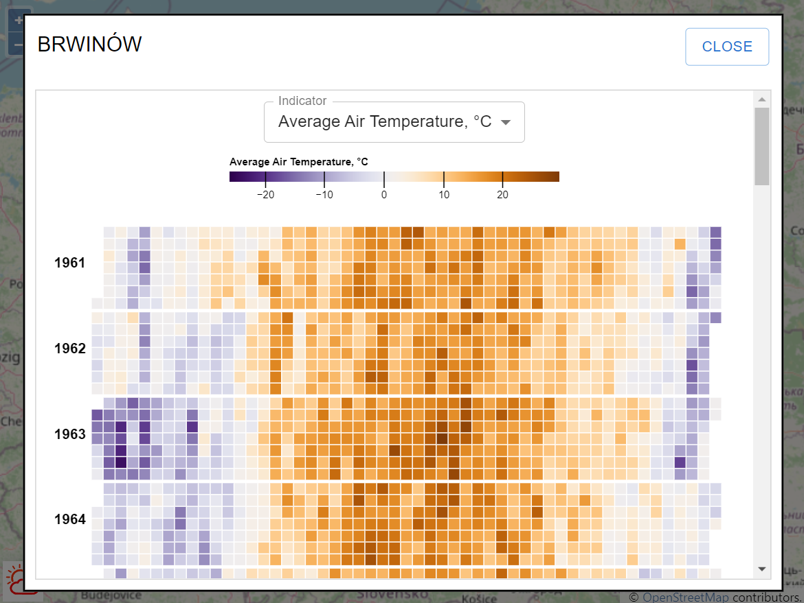

# "My city's climate" - historical weather data viewer

"My city's climate" is a free online viewer for historical weather data.

The application requires a climate database created by [mcc-import](https://github.com/karavanjo/mcc-import) application.

## Run

1. Fill `.env` file with your Realm data.
2. `npm install`
3. `npm run dev`
4. Open your browser (http://localhost:3000/)

## Screenshots

Weather stations map

Calendar: average air temperature

Calendar: snow depth

## Demo

[https://karavanjo.github.io/mcc-frontend/](https://karavanjo.github.io/mcc-frontend/)
